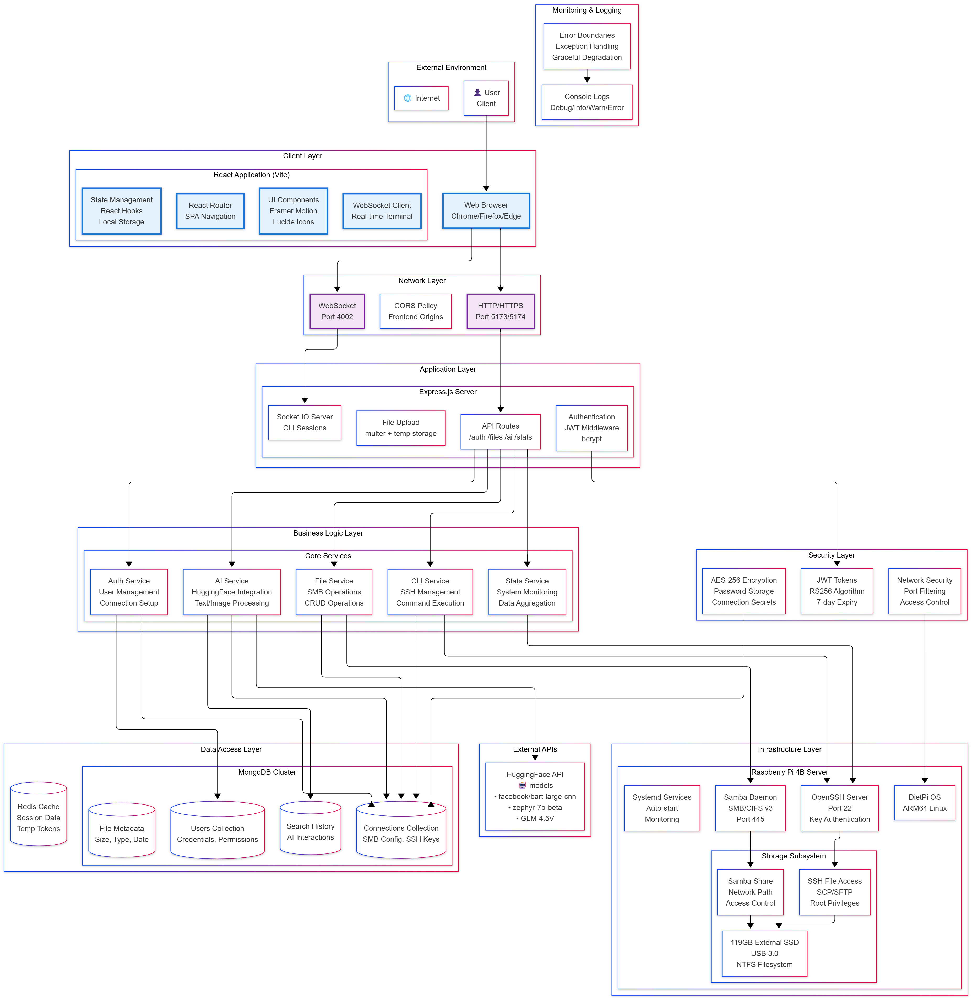

# Raspberry-NAS-Server
Made a fully fledged NAS Server using Raspberry Pi Model 4B, used samba and ntfs-3g for the setup, and works on pi OS.

Currently using third party software for managing the storage from android.
Also, trying to build a web application for managing the access, server connection, and storage management, basically a google drive(but mine)



## AI Chatbot Feature

This NAS server now includes an AI-powered chatbot that can understand natural language commands for file management operations.

### Features
- Natural language processing for file operations using Hugging Face's inference API
- File listing with various filters (by type, date, name)
- Folder creation and deletion
- File counting and search capabilities
- File movement and renaming
- Delete operations with confirmation for safety
- Image file identification
- Date-based file filtering

### Supported Commands
- "Show me files in the root directory"
- "Create a new folder called photos"
- "How many files are in documents?"
- "Find files containing 'report'"
- "Delete the old_backup folder" (requires confirmation)
- "Move report.pdf to archive"
- "Show me all image files"
- "List files from January 2025"

### API Endpoints
- POST /ai/chat - Main endpoint for natural language file operations
- POST /ai/summarize - Summarize text-based files (PDF, TXT)
- POST /ai/analyze-image - Analyze images using AI vision models

### Frontend Interface
A simple HTML interface is available at `/chat.html` for testing and interacting with the AI chatbot.


## AI Chatbot with Local Model Support

The NAS server now supports running AI models locally for maximum control and privacy. You can download and run FLAN-T5 models directly on your system instead of relying on external inference providers.

### Local AI Model Setup

#### Prerequisites
- Python 3.8+ installed on your NAS server
- At least 4GB RAM (8GB recommended for better performance)
- GPU optional but recommended for faster inference

#### Installation Steps

1. **Install Python dependencies:**
   ```bash
   cd NAS_SERVER
   pip install -r requirements.txt
   ```

2. **Download the model (optional - it will auto-download on first run):**
   ```python
   from transformers import AutoTokenizer, AutoModelForSeq2SeqLM

   # This will download ~250MB model
   tokenizer = AutoTokenizer.from_pretrained("google/flan-t5-small")
   model = AutoModelForSeq2SeqLM.from_pretrained("google/flan-t5-small")
   ```

3. **Start both services:**
   ```bash
   # On Linux/Mac
   ./start_services.sh

   # On Windows
   start_services.bat
   ```

#### How It Works

- **Python AI Service** (`ai_service.py`): Runs the FLAN-T5 model locally on port 5001
- **Node.js Server**: Communicates with the Python service for AI processing
- **Automatic Fallback**: If the AI service is unavailable, falls back to rule-based parsing

#### Benefits of Local Models

- **Privacy**: No data sent to external services
- **Reliability**: No dependency on internet connectivity or API limits
- **Performance**: Lower latency for AI responses
- **Cost**: No API usage costs
- **Control**: Full control over model behavior and updates

### Demo Version

For testing without setting up local models, a rule-based demo is available:

### Features
- Natural language processing for file operations using pattern matching
- Simulated file operations for demonstration
- Web-based interface for testing

### API Endpoints
- POST /ai-demo/demo-chat - Demo endpoint for natural language file operations (no file system required)

### Frontend Interface
A demo HTML interface is available at `/demo_chat.html` for testing the AI chatbot functionality without file system connections.

For detailed documentation, see [AI_CHATBOT_DEMO.md](NAS_SERVER/AI_CHATBOT_DEMO.md)

For detailed documentation on the full implementation, see [AI_CHATBOT.md](NAS_SERVER/AI_CHATBOT.md)

For local AI model setup instructions, see [LOCAL_AI_SETUP.md](NAS_SERVER/LOCAL_AI_SETUP.md)
For detailed documentation, see [AI_CHATBOT.md](NAS_SERVER/AI_CHATBOT.md)

Contributor - 
<a href="[https://github.com/Vivasvan20]"> Kovid Joshi</a>
